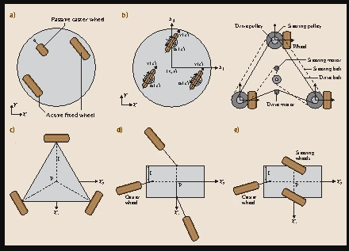

# Design Ideas
_Here we enter our ideat as draft and preliminary work of us._

## Types of Wheels

### Tracked vehicles/Continuous track
* High traction on rough, soft or uneven surface/terrain
* Increased payload capacity in terms of maximum weight
* BUT
* Slow speed compared to other wheel designes due to increase firiction
* High wheel worn and energy consupmtion
* Poor performance on on-road/smooth surfaces in terms of speed, maneuverability, and ride comfort.
* High cost and complexity

### Four-Wheeled
* 

### Three-Wheeled
* 

### Two-Wheeled
* ...

### Other Types
* See our reference [Chung, W., & Iagnemma, K. (2016). Wheeled robots. Springer Handbook of Robotics, 575-594.](https://link.springer.com/chapter/10.1007/978-3-319-32552-1_24)

## Robot Stablity

### Handling Distortion

#### Suspension System
* ...

#### Gimbal Stabilization
* ...

#### Sensor fusion
* ...

#### Kalman Filtering
* ...

#### Motion Planning
* ...

